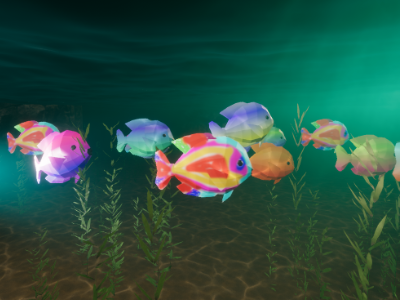
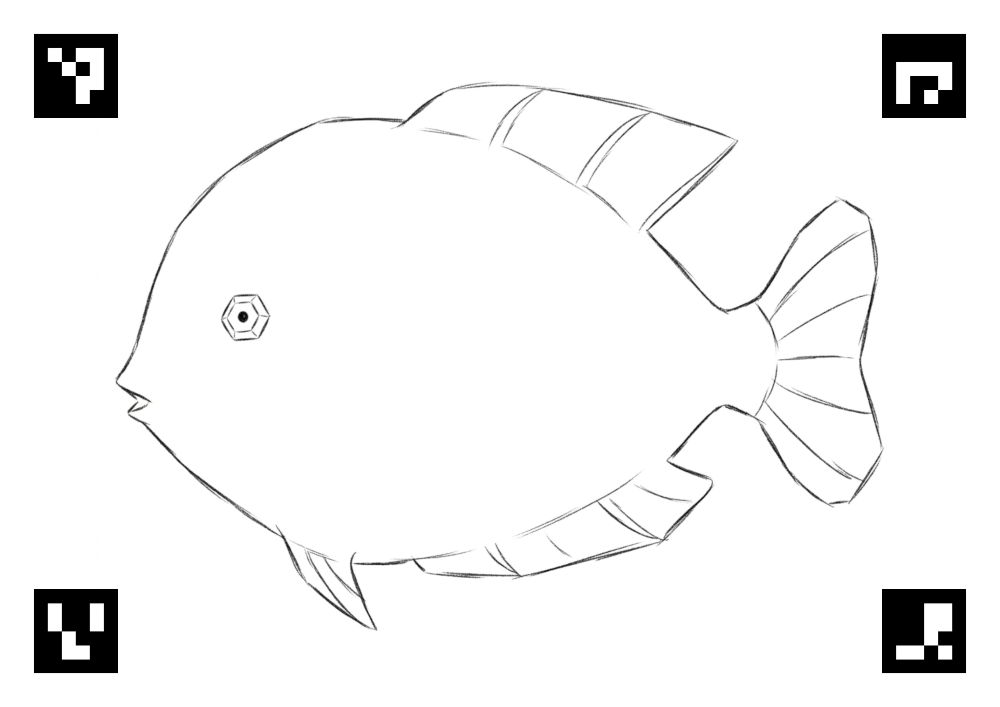
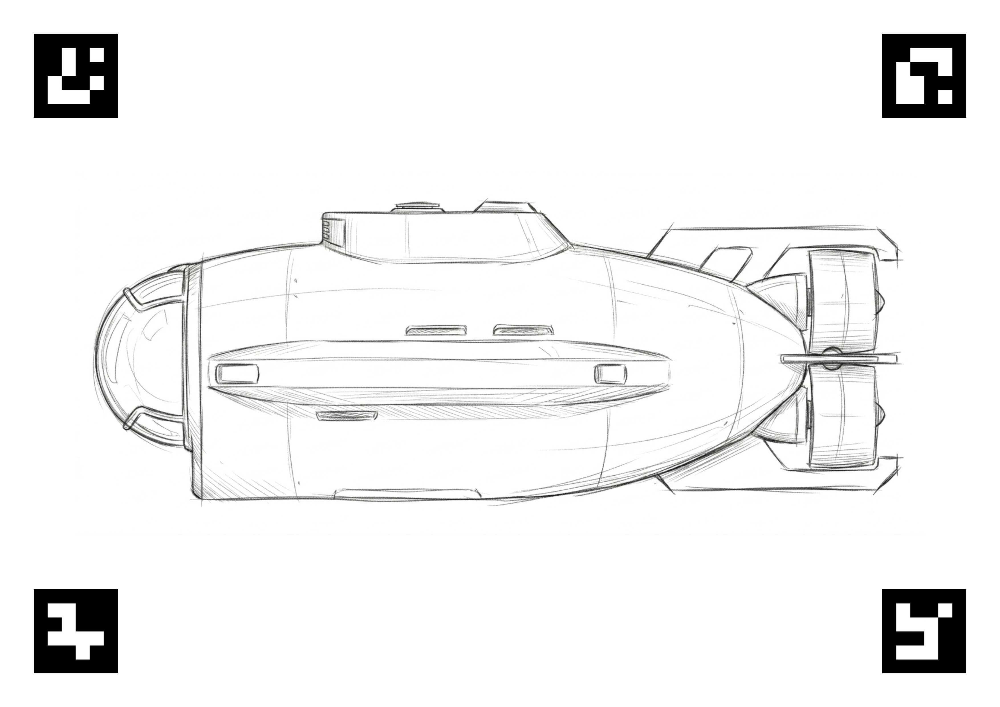

# SketchReef

- 3D-World: [SketchReef.x86_64](unity-build/SketchReef.x86_64)
- Backend: [app](unity-build/app) (started automatically)
- Upload-Webserver: 127.0.0.1:5000
- Photo-Folder: /photos (images placed here are processed automatically)

## Setup
- 3D-World: Unity
- Frontend: Vue.js
- Backend: Python (Flask, OpenCV)

Frontend and Backend are packaged into the [app](app-backend/dist/app) via PyInstaller

## Preview

## Sketches
- [sketch_fish.pdf](sketch/sketch_fish.pdf)
- [sketch_submarine.pdf](sketch/sketch_submarine.pdf)

## Credits

### 3D-Scene
Unity HDRP Sample Content
- https://docs.unity3d.com/Packages/com.unity.render-pipelines.high-definition@17.6/manual/HDRP-Sample-Content.html#water-samples
### Fisch
Denys Almaral
- https://assetstore.unity.com/packages/3d/characters/animals/fish/fish-alive-free-samples-362806
### Submarine
keptin
- https://www.turbosquid.com/3d-models/odyssey-submarine-3d-model-1799692